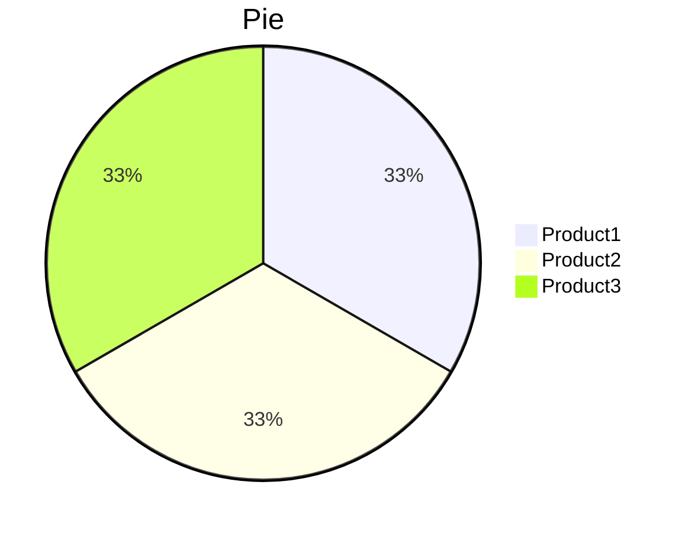
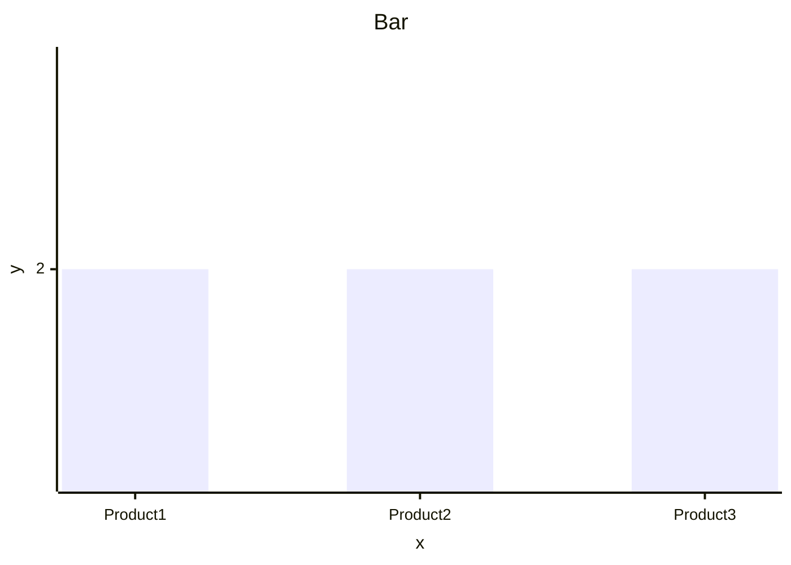

# DaxSharp

[**DaxSharp**](https://github.com/koanse/DaxSharp) is a .NET utility library that brings DAX-style summarization capabilities to LINQ collections. It offers flexible grouping, filtering, and aggregation of in-memory data structures in a concise, expressive way.

## 📦 Installation

Install via NuGet:

```bash
dotnet add package DaxSharp
```

## 🚀 Features
- Perform DAX-like SUMMARIZECOLUMNS on in-memory collections.
- Filter data before aggregation.
- Compute multiple aggregation expressions.
- Handle sparse or missing group combinations with Cartesian expansion.
- Optional ordering of results through the `orderBy` parameter.

## 🧪 Usage
### SummarizeColumns
Groups and filters items, then computes specified aggregations.

```csharp
using DaxSharp;
var data = new[]
{
    (Product: "Product1", Category: "Category1", IsActive: true, Amount: 10, Quantity: 2),
    (Product: "Product1", Category: "Category2", IsActive: true, Amount: 20, Quantity: 3),
    (Product: "Product2", Category: "Category1", IsActive: true, Amount: 5, Quantity: 1),
    (Product: "Product3", Category: "Category3", IsActive: true, Amount: 15, Quantity: 2)
}.ToList();

var results = data.SummarizeColumns(
    item => new { item.Product, item.Category },
    x => x.IsActive && x.Category != "Category1",
    (_, _) => true,
    (items, g) =>
        items.ToArray() is { Length: > 0 } array
            ? array.Sum(x => x.Amount)
            : 2
).ToList();
```

The results are:
- Product1, Category1, 2
- Product1, Category2, 20
- Product2, Category1, 2
- Product3, Category3, 15

DAX:
```
EVALUATE
    SUMMARIZECOLUMNS(
        Sales[Product],
        Sales[Category],
        FILTER(
            Categories,
            Categories[IsActive] = TRUE && Categories[Category] <> "Category1"
        ),
        "Sum", IF(
            ISBLANK(SUM(Sales[Amount])),
            2,
            SUM(Sales[Amount])
        )
    )
```

When the `orderBy` parameter is provided, the method processes groups in the specified order and includes cartesian combinations - meaning it will generate results for all combinations specified in the `orderBy` collection when aggregations on missing data aren't all null or zero.

```csharp
using DaxSharp;
var data = new[]
{
    (Product: "Product1", Category: "Category1", IsActive: true, Amount: 10, Quantity: 2),
    (Product: "Product1", Category: "Category2", IsActive: true, Amount: 20, Quantity: 3),
    (Product: "Product2", Category: "Category1", IsActive: true, Amount: 5, Quantity: 1),
    (Product: "Product3", Category: "Category3", IsActive: true, Amount: 15, Quantity: 2)
}.ToList();

var results = data.SummarizeColumns(
    item => new { item.Product, item.Category },
    item => item is { IsActive: true, Category: not "Category1" },
    (_, g) => g is { Category: not "Category1" },
    (items, _) =>
        items.ToArray() is { Length: > 0 } array
            ? array.Sum(x => x.Amount)
            : 2,
    from pId in Enumerable.Range(1, 3)
    from cId in Enumerable.Range(1, 3)
    select new { Product = $"Product{pId}", Category = $"Category{cId}" }
).ToList();
```

The results are:
- Product3, Category2, 2
- Product3, Category3, 15
- Product2, Category2, 2
- Product2, Category3, 2
- Product1, Category2, 20
- Product1, Category3, 2

DAX:
```
EVALUATE
    SUMMARIZECOLUMNS(
        Products[Product],
        Categories[Category],
        FILTER(
            Categories,
            Categories[IsActive] = TRUE && Categories[Category] <> "Category1"
        ),
        "Sum", IF(
            ISBLANK(SUM(Sales[Amount])),
            2,
            SUM(Sales[Amount])
        )
    )
ORDER BY Products[Product] DESC
```

## 🛠️ API Reference
`SummarizeColumns<T, TGrouped, TExpressions>`
```csharp
public static IEnumerable<(TGrouped? grouped, TExpressions expressions)> SummarizeColumns<T, TGrouped, TExpressions>(
    this T[] items,
    Func<T, TGrouped> groupBy,
    Func<T?, bool> itemFilter,
    Func<IEnumerable<T?>, TGrouped?, bool> groupFilter,
    Func<IEnumerable<T>, TGrouped?, TExpressions?> expressions,
    IEnumerable<TGrouped>? orderBy = null,
    int maxCount = int.MaxValue)
    where TGrouped : notnull
```

## 🎨 UI Extensions
Helpers in `DaxSharpUiExtensions` to render results as Markdown or Mermaid.

Test data to apply UI extensions:
```csharp
using DaxSharp;

var data = new[]
{
    (ProductId: 1, Product: "Product1", Category: "Category1", IsActive: true, Amount: 10, Quantity: 2),
    (ProductId: 2, Product: "Product1", Category: "Category2", IsActive: true, Amount: 20, Quantity: 3),
    (ProductId: 3, Product: "Product2", Category: "Category1", IsActive: true, Amount: 5, Quantity: 1),
    (ProductId: 4, Product: "Product3", Category: "Category3", IsActive: true, Amount: 15, Quantity: 2)
};

var results = data.SummarizeColumns(
    item => new { item.ProductId, item.Product },
    item => item is { IsActive: true, Category: not "Category1" },
    (_, _) => true,
    (items, _) => new
    {
        sum = items.ToArray() is { Length: > 0 } array
            ? array.Sum(x => x.Amount)
            : 2
    },
    from pId in Enumerable.Range(1, 3)
        select new { ProductId = pId, Product = $"Product{pId}" }
    ).ToList();
```

DAX:
```
    EVALUATE
     SUMMARIZECOLUMNS(
        Products[Product],
        Categories[Category],
        FILTER(
            Categories,
            Categories[IsActive] = TRUE && Categories[Category] <> "Category1"
        ),
        "Sum", IF(
            ISBLANK(SUM(Sales[Amount])),
            2,
            SUM(Sales[Amount])
        )
    )
    ORDER BY Products[Product] DESC
```

- **ToMarkdownTable**: Renders a Markdown table using public properties of group and expression types.

```csharp
string markdownTable = results.ToMarkdownTable();
```

Result:
```markdown
| ProductId | Product | sum |  
| --- | --- | --- |  
| 1 | Product1 | 2 |  
| 2 | Product2 | 2 |  
| 3 | Product3 | 2 |
```

| ProductId | Product | sum |  
| --- | --- | --- |  
| 1 | Product1 | 2 |  
| 2 | Product2 | 2 |  
| 3 | Product3 | 2 |

- **ToMermaidPieChart**: Builds a Mermaid pie chart snippet.

```csharp
string mermaidPie = results.ToMermaidPieChart("Pie", x => x.Product, x => x.sum.ToString());
```



- **ToMermaidLineChart**: Builds a Mermaid `xychart-beta` line chart.

```csharp
string mermaidLine = results.ToMermaidLineChart("Line", "x", "y",  x => x.ProductId.ToString(), x => x.sum.ToString());
```

```mermaid
xychart-beta title "Line"
    x-axis x  [1,2,3]
    y-axis y line [2,2,2]
```

- **ToMermaidBarChart**: Builds a Mermaid `xychart-beta` bar chart.

```csharp
string mermaidBar = results.ToMermaidBarChart("Bar", "x", "y", x => x.Product, x => x.sum.ToString());
```



Notes:
- Group and expression selectors should return strings for Mermaid helpers.

## ⚡ Performance
DaxSharp is optimized for high-performance data processing with parallel execution.
The library leverages multi-threading and efficient memory management to handle large datasets efficiently.

### Performance Test Examples

#### 100 Million Rows Test
Handles 100 million fact table rows in ~0.7 seconds
```csharp
using DaxSharp;
using System.Diagnostics;

var stopwatch = new Stopwatch();
stopwatch.Start();

// Create 100 million fact table rows
var sales = Enumerable.Range(0, 100000000)
    .Select(i => (productId: i % 1000000, customerId: i % 1000000, amount: i % 100))
    .ToArray();

stopwatch.Stop();
Console.WriteLine($"Data creation: {stopwatch.Elapsed}");

stopwatch.Restart();

// Process with SummarizeColumns - equivalent to DAX TOPN(1000, SUMMARIZECOLUMNS(...))
var result = sales.SummarizeColumns(
    x => new { x.productId, x.customerId },
    (_, _) => true,
    (x, g) => x.ToArray() is { Length: > 0 } array
        ? array.Sum(y => y.amount)
        : 1,
    from pId in Enumerable.Range(0, 1000000)
    from cId in Enumerable.Range(0, 1000000)
    select new { productId = pId, customerId = cId },
    1000
).ToList();

stopwatch.Stop();
Console.WriteLine($"Processing: {stopwatch.Elapsed}");
```

#### 1 Billion Rows Test
Handles 1 billion fact table rows in ~4.4 seconds.
```csharp
using DaxSharp;
using System.Diagnostics;

var stopwatch = new Stopwatch();
stopwatch.Start();

// Create 1 billion fact table rows
var sales = Enumerable.Range(0, 1000000000)
    .Select(i => (productId: i % 1000000, customerId: i % 1000000, amount: i % 100))
    .ToArray();

stopwatch.Stop();
Console.WriteLine($"Data creation: {stopwatch.Elapsed}");

stopwatch.Restart();

// Process with SummarizeColumns
var result = sales.SummarizeColumns(
    x => new { x.productId, x.customerId },
    (_, _) => true,
    (x, g) => x.ToArray() is { Length: > 0 } array
        ? array.Sum(y => y.amount)
        : 1,
    from pId in Enumerable.Range(0, 1000000)
    from cId in Enumerable.Range(0, 1000000)
    select new { productId = pId, customerId = cId },
    1000
).ToList();

stopwatch.Stop();
Console.WriteLine($"Processing: {stopwatch.Elapsed}");
```

DAX:
```
EVALUATE
    TOPN(
        1000,
        SUMMARIZECOLUMNS(
            Products[ProductId],
            Categories[CategoryId],
            "Sum", IF(
                ISBLANK(SUM(Sales[Amount])),
                1,
                SUM(Sales[Amount])
            )
        )
    )
```

## 🔄 Power BI to PostgreSQL Export

DaxSharp provides comprehensive tools for exporting data and converting queries from Power BI to PostgreSQL.

### Export All Tables

Export all tables from Power BI to PostgreSQL with automatic schema creation:

```csharp
using DaxSharp;

var config = DaxSharpConfig.Instance;
var results = DaxSharpPbiExportToPostgres.ExportAllTables(
    pbiConnectionString: config.ConnectionStrings.PowerBi,
    postgresConnectionString: config.ConnectionStrings.PostgreSQL
);

// results is a Dictionary<string, int> with table names and row counts
foreach (var result in results)
{
    Console.WriteLine($"Table {result.Key}: {result.Value} rows exported");
}
```

### Lazy Loading DAX Queries

Execute DAX queries with lazy loading for processing large datasets incrementally:

```csharp
using DaxSharp;

var connectionString = config.ConnectionStrings.PowerBi;
const string query = "EVALUATE 'sales'";

// Process rows incrementally without loading everything into memory
foreach (var row in DaxSharpPbiExportExtensions.ExecuteDaxQueryEnumerable(connectionString, query))
{
    foreach (var column in row)
    {
        Console.WriteLine($"{column.Key}: {column.Value}");
    }
}
```

### Convert DAX to SQL with Validation

Convert DAX queries to PostgreSQL SQL using OpenAI API with automatic validation and iterative error fixing:

```csharp
using DaxSharp;

const string daxQuery = """
    EVALUATE
    SUMMARIZECOLUMNS(
        product[product_color],
        customer[customer_gender],
        FILTER(
            customer,
            customer[customer_gender] = "M"
        ),
        "Total Sales", CALCULATE(
            SUM(sales[amount]),
            FILTER(
                product,
                product[product_color] IN {
                    "Green",
                    "Silver"
                }
            )
        )
    )
    """;

var config = DaxSharpConfig.Instance;
var apiKey = Environment.GetEnvironmentVariable("OPENAI_API_KEY") 
             ?? config.OpenAi.DefaultApiKey;

var result = await DaxSharpPbiExportToPostgres.ConvertDaxToSqlWithValidation(
    daxQuery: daxQuery,
    pbiConnectionString: config.ConnectionStrings.PowerBi,
    postgresConnectionString: config.ConnectionStrings.PostgreSQL,
    schemaName: config.PostgreSql.DefaultSchema,
    apiKey: apiKey,
    maxIterations: config.OpenAi.DefaultMaxIterations
);

if (result.ResultsMatch)
{
    Console.WriteLine($"SQL Query: {result.SqlQuery}");
    Console.WriteLine($"Results match! PowerBI: {result.PowerBiResults.Count} rows, PostgreSQL: {result.PostgresResults.Count} rows");
}
else
{
    Console.WriteLine($"Error: {result.ErrorMessage}");
}
```

**Features:**
- Automatic DAX to SQL conversion using OpenAI
- Results validation by comparing Power BI and PostgreSQL query results
- Iterative error fixing with configurable max iterations
- Caching to avoid redundant API calls
- Schema-aware conversion using database metadata

### Get Database Schema

Retrieve complete database schema including tables, columns, and relationships:

```csharp
using DaxSharp;

var connectionString = config.ConnectionStrings.PowerBi;
var schema = DaxSharpPbiExportExtensions.GetDatabaseSchema(connectionString);

foreach (var table in schema.Tables)
{
    Console.WriteLine($"Table: {table.TableName}");
    foreach (var column in table.Columns)
    {
        Console.WriteLine($"  Column: {column.Name} ({column.DataType}, nullable: {column.IsNullable})");
    }
    
    foreach (var relationship in table.Relationships)
    {
        Console.WriteLine($"  Relationship: {table.TableName}[{relationship.FromColumn}] -> {relationship.ToTable}[{relationship.ToColumn}] ({relationship.RelationshipType})");
    }
}
```

### Get Database Schema Description

Get a formatted text description of the database schema:

```csharp
using DaxSharp;

var connectionString = config.ConnectionStrings.PowerBi;
var description = DaxSharpPbiExportExtensions.GetDatabaseSchemaDescription(connectionString);

Console.WriteLine(description);
```

Output format:
```
Table sales, columns:
  product_id (Int32, nullable)
  customer_id (Int32, nullable)
  amount (Decimal, nullable)
Relationships:
  sales[product_id] -> product[id]: ManyToOne

Table product, columns:
  id (Int32, not null)
  name (String, nullable)
```

## ⚙️ Internals

Cartesian expansion in `SummarizeColumns` fills in missing group key combinations with expression results.

Skips results with all null expressions unless expansion is required.

When `orderBy` is specified, the method ensures all combinations in the `orderBy` collection are included in the results.

## 📄 License
MIT